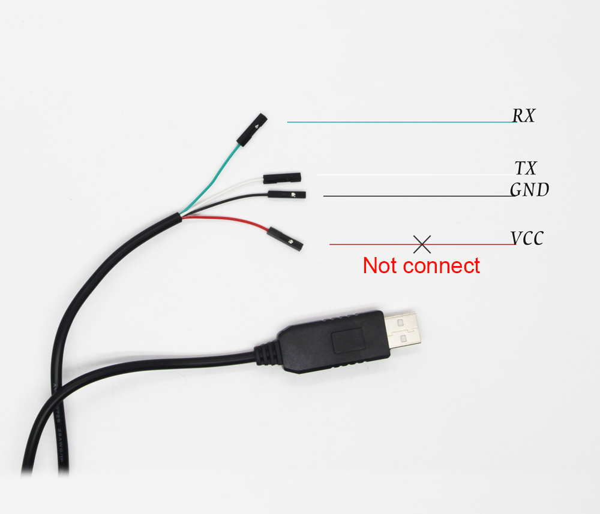
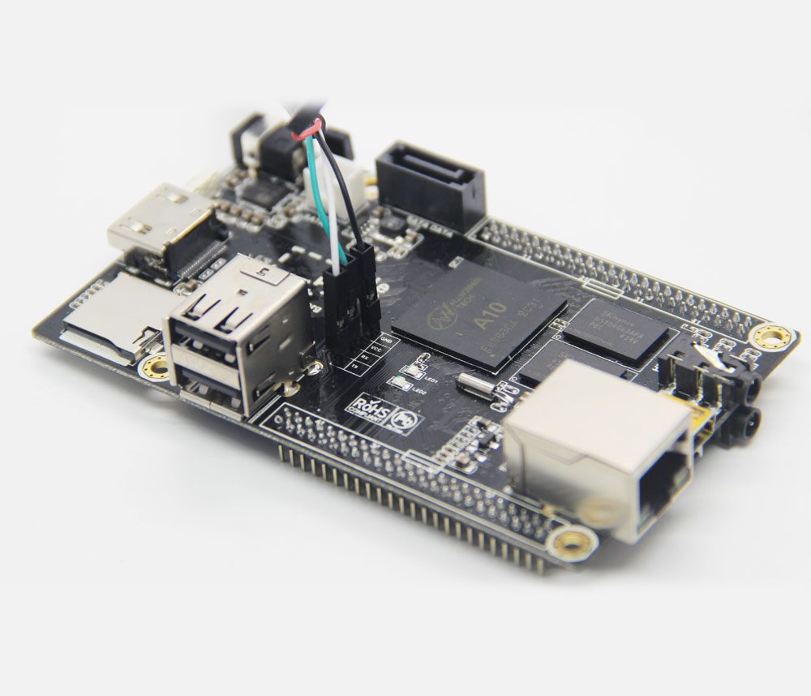
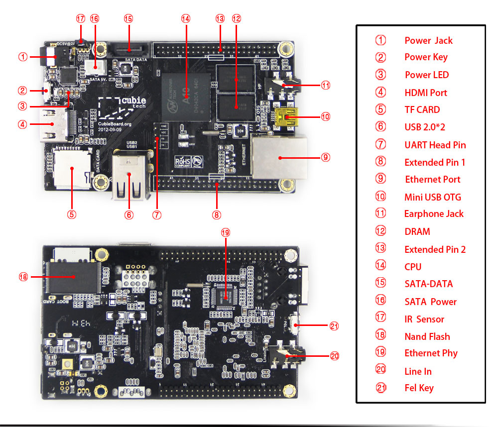

# Public Domain Documents

- [Notes](#notes)
- [Cubietech](#cubietech)
  - [USB UART Cable](#usb-uart-cable)
  - [CubieBoard 1](#cubieboard-1)

---

## Notes

Open and convert `.dwg` and `.dxf` with FreeCAD and ODA File Converter, see:
https://askubuntu.com/a/1136178

---

## Cubietech

* http://www.cubietech.com/
* http://cubieboard.org/
  * http://cubieboard.org/model
  * http://cubieboard.org/download
    * http://dl.cubieboard.org/
  * http://docs.cubieboard.org/
* https://linux-sunxi.org/
  * http://dl.linux-sunxi.org/
* http://cubian.org/
* https://www.armbian.com/download/?tx_maker=cubietech

---

### USB UART Cable

#### Construction

| Release    | Schematic                                                                             | Layout (PCB)    | 2D Drawing | 3D Model   | Status     |
| :--------: | :-----------------------------------------------------------------------------------: | :-------------: | :--------: | :--------: | :--------: |
| V1         |                                                                                       | SJ-019 V3.0     |            |            |            |
| V2         |                                                                                       | SJ-019 V6.0     |            |            |            |
| V3         |                                                                                       | SJ-039 V1.0     |            |            |            |

#### Components

##### Electronic Parts

| Component                                          | Manufactor                                    | Name                                     | V1/2/3            | Package         | Refs            |
| :------------------------------------------------- | :-------------------------------------------- | :--------------------------------------- | :---------------: | :-------------- | :-------------: |
| USB to Serial Bridge Controller, 3.3/5V, USB 1.1   | [*Prolific*](Prolific/00-comefrom-urls)       | [**PL2303HX**](Prolific/PL2303)          | `U1`              | SSOP28-0.65mm   | [IMG][iCUCPLC]  |

[iCUCPLC]: Cubietech/USBUARTCable/IMG/cubieboard-uart-4.jpg

#### Assembly

|  |  |
| :--------------------------------------------------------: | :--------------------------------------------------------: |
| *UART 3.3V TTL wires*                                      | *CubieBoard 1&2 connection*                                |

* http://www.cubietech.com/product-detail/usb-uart-cable
* http://linux-sunxi.org/Cubieboard/TTL

---

### CubieBoard 1

#### Construction

| Release    | Schematic                                                                             | Layout (PCB)    | 2D Drawing | 3D Model   | Status     |
| :--------: | :-----------------------------------------------------------------------------------: | :-------------: | :--------: | :--------: | :--------: |
| V1         | [2012-08-08](Cubietech/CubieBoard1/CAD/cubieboard_schematic_2012-08-08.pdf)           | 2012-09-09      |            |            | **EOL**    |

#### Components

##### Electronic Parts

| Component                                          | Manufactor                                    | Name                                     | V1                     | Package         | Refs            |
| :------------------------------------------------- | :-------------------------------------------- | :--------------------------------------- | :--------------------: | :-------------- | :-------------: |
| Central Procesing Unit (CPU), ARM Cortex-A8 @ 1GHz | [*Allwinner*](Allwinner/00-comefrom-urls)     | [**A10**](Allwinner/A10)                 | `U1`                   | FBGA441-0.8mm   | [IMG][iCB1CPU]  |
| Random Access Memory (DDR3-SDRAM), 512MB @ 480MHz  | [*GT*](GT/00-comefrom-urls)                   | [**GT8UB128M16BP**](GT/GT8UB128M16BP)    | `U2`, `U3`             | FBGA96-0.8mm    |                 |
| Random Access Memory (DDR3-SDRAM), 1GB @ 480MHz    |                                               | [**GT8UB256M16BP**](GT/GT8UB256M16BP)    |                        |                 | [IMG][iCB1DDR3] |
| NAND Technology Flash (NAND-Flash), 4GB            | [*Samsung*](Samsung/00-comefrom-urls)         | [**K9K8G08U0A**](Samsung/K9K8G08U0A)     | `U4`                   | TSOP48-0.5mm    |                 |
|                                                    |                                               | [**K9GBG08U0A**](Samsung/K9GBG08U0A)     |                        |                 | [IMG][iCB1NAND] |
| Power Management IC (PMIC), Li-Battery Charger     | [*X-Powers*](X-Powers/00-comefrom-urls)       | [**AXP209**](X-Powers/AXP209)            | `U6`                   | QFN48-0.4mm     | [IMG][iCB1PMIC] |
| Step Down Regulator, 1.5V (DDR3), 3.3V (I/O)       |                                               |  **TCS4199**                             | `U5`, `U7`             | SOT23-5         |                 |
| LDO Voltage Regulator, 2.5V (SATA)                 | [*TCS*](TCS/00-comefrom-urls)                 | [**TCS2108-25**](TCS)                    | `U8`                   | SOT25-0.95mm    |                 |
|                                                    | [*Chipown*](Chipown/00-comefrom-urls)         | [**AP1231**](Chipown)                    |                        |                 |                 |
| pMOSFET 2.5-V (G-S) 1A, 5V (SATA), 3.3V (EMAC)     | [*TCS*](TCS/00-comefrom-urls)                 | [**TCS1305**](TCS)                       | `Q1`, `Q6`             | SOT23-0.95mm    | [IMG][iCB1SATA] |
| Low RDS(ON) Load Switch, VBUS USB Host, USB OTG    | [*TCS*](TCS/00-comefrom-urls)                 | [**TCS9708**](TCS)                       | `U10`, `U11`, `U12`    | SOT23-5-0.95mm  |                 |
| 10/100M Fast Ethernet PHY Receiver (EMAC)          | [*Realtek*](Realtek/00-comefrom-urls)         | [**RTL8201CP**](Realtek/RTL8201CP)       | `U13`                  | LQFP48-0.5mm    | [IMG][iCB1EMAC] |
| IR Receiver                                        | [*Vishay*](Vishay/00-comefrom-urls)           | [**HS0038B-NEC**](Vishay)                | `U9`                   |                 |                 |

[iCB1CPU]:  Cubietech/CubieBoard1/IMG/cubieboard1-6.jpg
[iCB1DDR3]: Cubietech/CubieBoard1/IMG/cubieboard1-7-gt.jpg
[iCB1NAND]: Cubietech/CubieBoard1/IMG/cubieboard2-22-samsung.jpg
[iCB1PMIC]: Cubietech/CubieBoard1/IMG/cubieboard1-12.jpg
[iCB1SATA]: Cubietech/CubieBoard1/IMG/cubieboard1-11.jpg
[iCB1EMAC]: Cubietech/CubieBoard1/IMG/cubieboard1-10.jpg

#### Assembly



* http://www.cubietech.com/product-detail/cubieboard1
* https://linux-sunxi.org/Cubietech_Cubieboard
* https://hands.com/~lkcl/eoma/allwinner
* https://github.com/allwinner-zh/documents
* https://github.com/SoM-Boards

##### Console


* https://linux-sunxi.org/Cubietech_Cubieboard#Adding_a_serial_port
* http://linux-sunxi.org/Cubieboard/TTL
* http://linux-sunxi.org/UART#UART-USB_dongle

##### Expansion Ports

|  |  |
| :-------------------------------------------------------------------------------------------------------: | :--------------------------------------------------------------------------------: |
| [*Drawing*](Cubietech/CubieBoard1/CAD/a10_a20_cubieboard_expansion_ports.pdf)                             | [*Drawing*](Cubietech/CubieBoard1/CAD/gpio_defination_cubian.pdf)                  |

#### Armbian

* https://www.armbian.com/cubieboard-1/ (End of Support)

---

<!--
shell script I used to generare the TOC on top of this file manually:
cat README.md \
    | sed -e '/```/ r pf' -e '/```/,/```/d' \
    | grep "^#" \
    | tail -n +2 \
    | tr -d '`' \
    | sed 's/# \([a-zA-Z0-9`. -]\+\)/- [\1](#\L\1)/' \
    | awk -F'(' '{for(i=2;i<=NF;i++)if(i==2)gsub(" ","-",$i);}1' OFS='(' \
    | sed 's/^####/      /' \
    | sed 's/^###/    /' \
    | sed 's/^##/  /' \
    | sed 's/^#//'
-->
