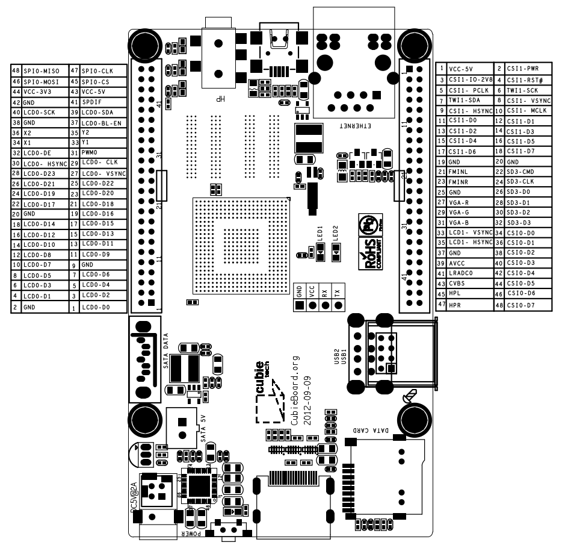
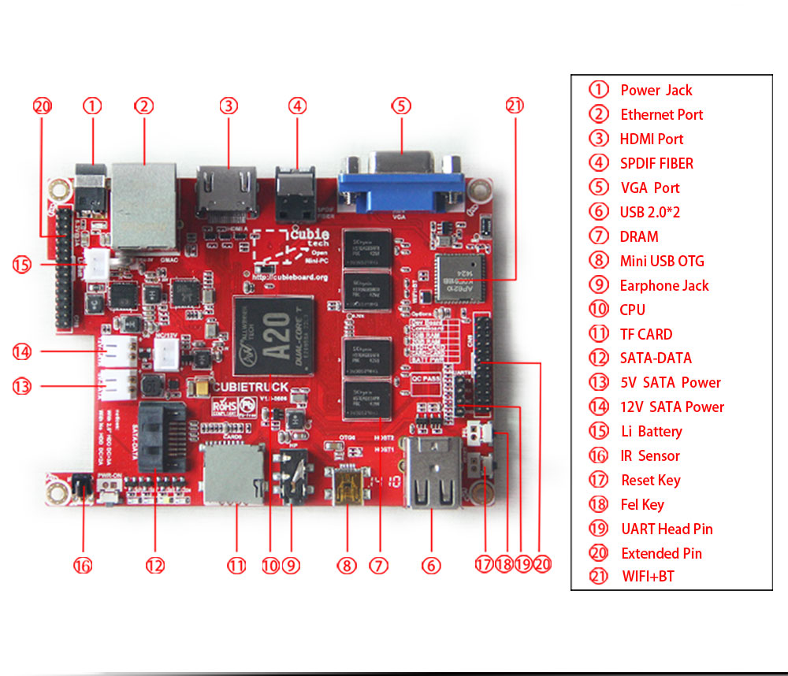
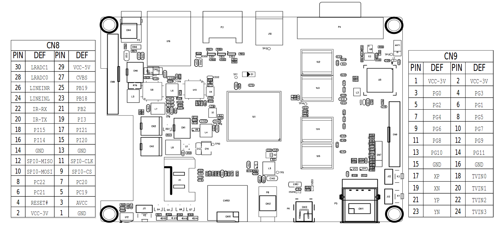

# Public Domain Documents

- [Notes](#notes)
- [Cubietech](#cubietech)
  - [USB UART Cable](#usb-uart-cable)
  - [CubieBoard 1](#cubieboard-1)
  - [CubieBoard 2](#cubieboard-2)
  - [CubieBoard 3 - CubieTruck](#cubieboard-3---cubietruck)

---

## Notes

Open and convert `.dwg` and `.dxf` with FreeCAD and ODA File Converter, see:
https://askubuntu.com/a/1136178

---

## Cubietech

* http://www.cubietech.com/
* http://cubieboard.org/
  * http://cubieboard.org/model
  * http://cubieboard.org/download
    * http://dl.cubieboard.org/
  * http://docs.cubieboard.org/
* https://linux-sunxi.org/
  * http://dl.linux-sunxi.org/
* http://cubian.org/
* https://www.armbian.com/download/?tx_maker=cubietech

---

### USB UART Cable

#### Construction

| Release    | Schematic                           | Layout (PCB)                        | 2D Drawing                          | 3D Model                            | Status     |
| :--------: | :---------------------------------: | :---------------------------------: | :---------------------------------: | :---------------------------------: | :--------: |
| V1         |                                     | SJ-019 V3.0                         |                                     |                                     |            |
| V2         |                                     | SJ-019 V6.0                         |                                     |                                     |            |
| V3         |                                     | SJ-039 V1.0                         |                                     |                                     |            |

#### Components

##### Electronic Parts

| Component                                          | Manufactor                                    | Name                                     | V1/2/3          | Package         | Refs            |
| :------------------------------------------------- | :-------------------------------------------- | :--------------------------------------- | :-------------: | :-------------- | :-------------: |
| USB to Serial Bridge Controller, 3.3/5V, USB 1.1   | [*Prolific*](Prolific/00-comefrom-urls)       | [**PL2303HX**](Prolific/PL2303)          | `U1`            | SSOP28-0.65mm   | [IMG][iCUCPLC]  |

[iCUCPLC]: Cubietech/USBUARTCable/IMG/cubieboard-uart-4.jpg

#### Assembly

| ![Cable][iCUCCABLE]          | ![Board][iCUCBOARD]          |
| :--------------------------: | :--------------------------: |
| *UART 3.3V TTL wires*        | *CubieBoard 1&2 connection*  |

[iCUCCABLE]: Cubietech/USBUARTCable/IMG/cubieboard-uart-6.jpg
[iCUCBOARD]: Cubietech/USBUARTCable/IMG/cubieboard-uart-3.jpg

* http://www.cubietech.com/product-detail/usb-uart-cable
* http://linux-sunxi.org/Cubieboard/TTL

---

### CubieBoard 1

#### Construction

| Release    | Schematic                           | Layout (PCB)                        | 2D Drawing                          | 3D Model                            | Status     |
| :--------: | :---------------------------------: | :---------------------------------: | :---------------------------------: | :---------------------------------: | :--------: |
| V1         | [PDF][dCB1V1PSC]                    | 2012-09-09                          | [DXF][dCB1V1DXF] ([PDF][dCB1V1P2D]) |                                     | **EOL**    |

[dCB1V1PSC]:
   Cubietech/CubieBoard1/CAD/cubieboard_schematic_2012-08-08.pdf
   "2012-08-08 (A10-cubieboard-2012-08-08, Rev: V1.0)"
[dCB1V1DXF]:
   Cubietech/CubieBoard1/CAD/Cubieboard1&2%20Mechanical_120909.dxf
   "2012-09-09"
[dCB1V1P2D]:
   Cubietech/CubieBoard1/CAD/Cubieboard1&2%20Mechanical_120909.pdf
   "2012-09-09"

#### Components

##### Electronic Parts

| Component                                          | Manufactor                                    | Name                                     | V1              | Package         | Refs            |
| :------------------------------------------------- | :-------------------------------------------- | :--------------------------------------- | :-------------: | :-------------- | :-------------: |
| Central Procesing Unit (CPU), ARM Cortex-A8 @ 1GHz | [*Allwinner*](Allwinner/00-comefrom-urls)     | [**A10**](Allwinner/A10)                 | `U1`            | FBGA441-0.8mm   | [IMG][iCB1CPU]  |
| Random Access Memory (DDR3-SDRAM), 512MB @ 480MHz  | [*GT*](GT/00-comefrom-urls)                   | [**GT8UB128M16BP**](GT/GT8UB128M16BP)    | `U2`, `U3`      | FBGA96-0.8mm    |                 |
| Random Access Memory (DDR3-SDRAM), 1GB @ 480MHz    |                                               | [**GT8UB256M16BP**](GT/GT8UB256M16BP)    |                 |                 | [IMG][iCB1DDR3] |
| NAND Technology Flash (NAND-Flash), 4GB            | [*Samsung*](Samsung/00-comefrom-urls)         | [**K9K8G08U0A**](Samsung/K9K8G08U0A)     | `U4`            | TSOP48-0.5mm    |                 |
|                                                    |                                               | [**K9GBG08U0A**](Samsung/K9GBG08U0A)     |                 |                 | [IMG][iCB1NAND] |
| Power Management IC (PMIC), Li-Battery Charger     | [*X-Powers*](X-Powers/00-comefrom-urls)       | [**AXP209**](X-Powers/AXP209)            | `U6`            | QFN48-0.4mm     | [IMG][iCB1PMIC] |
| Step Down Regulator, 1.5V (DDR3), 3.3V (I/O)       |                                               |  **TCS4199**                             | `U5`, `U7`      | SOT23-5         |                 |
| LDO Voltage Regulator, 2.5V (SATA)                 | [*TCS*](TCS/00-comefrom-urls)                 | [**TCS2108-25**](TCS)                    | `U8`            | SOT25-0.95mm    |                 |
|                                                    | [*Chipown*](Chipown/00-comefrom-urls)         | [**AP1231**](Chipown)                    |                 |                 |                 |
| pMOSFET 2.5-V (G-S) 1A, 5V (SATA), 3.3V (EMAC)     | [*TCS*](TCS/00-comefrom-urls)                 | [**TCS1305**](TCS)                       | `Q1`, `Q6`      | SOT23-0.95mm    | [IMG][iCB1SATA] |
| Low RDS(ON) Load Switch, VBUS USB Host, USB OTG    | [*TCS*](TCS/00-comefrom-urls)                 | [**TCS9708**](TCS)                       | `U10 - U12`     | SOT23-5-0.95mm  |                 |
| 10/100M Fast Ethernet PHY Receiver (EMAC)          | [*Realtek*](Realtek/00-comefrom-urls)         | [**RTL8201CP**](Realtek/RTL8201CP)       | `U13`           | LQFP48-0.5mm    | [IMG][iCB1EMAC] |
| IR Receiver                                        | [*Vishay*](Vishay/00-comefrom-urls)           | [**HS0038B-NEC**](Vishay)                | `U9`            |                 |                 |

[iCB1CPU]:  Cubietech/CubieBoard1/IMG/cubieboard1-6.jpg
[iCB1DDR3]: Cubietech/CubieBoard1/IMG/cubieboard1-7-gt.jpg
[iCB1NAND]: Cubietech/CubieBoard1/IMG/cubieboard2-22-samsung.jpg
[iCB1PMIC]: Cubietech/CubieBoard1/IMG/cubieboard1-12.jpg
[iCB1SATA]: Cubietech/CubieBoard1/IMG/cubieboard1-11.jpg
[iCB1EMAC]: Cubietech/CubieBoard1/IMG/cubieboard1-10.jpg

#### Assembly

| ![Board 2012-09-09][iCB1BOARD]     |
| :--------------------------------: |
| *CubieBoard 1*                     |

[iCB1BOARD]: Cubietech/CubieBoard1/IMG/cubieboard1-8.jpg

* http://www.cubietech.com/product-detail/cubieboard1
* https://linux-sunxi.org/Cubietech_Cubieboard
* https://hands.com/~lkcl/eoma/allwinner
* https://github.com/allwinner-zh/documents
* https://github.com/SoM-Boards

##### Console

| ![r12]&#x2757;<span class='note'>TTL 3.3V</span>&#x2757;![r12] |
| :------------------------------------------------------------: |
| &#x2B95; `console=ttyS0,115200n8`                              |
| ![Console 2012-09-09][iCB1CONS]                                |

[iCB1CONS]: Cubietech/USBUARTCable/IMG/Cubieboard.UART-TTL_wire_colors.jpg#w=300

* https://linux-sunxi.org/Cubietech_Cubieboard#Adding_a_serial_port
* http://linux-sunxi.org/Cubieboard/TTL
* http://linux-sunxi.org/UART#UART-USB_dongle

##### Expansion Ports

| ![CB1 Expansion Ports Drawing][iCB1EXPPD]     | ![Cubian GPIO Pin Definition][iCB1GPIOD]      |
| :-------------------------------------------: | :-------------------------------------------: |
| [*Drawing*][dCB1EXPPD]                        | [*Drawing*][dCB1EXPPD]                        |

[iCB1EXPPD]: Cubietech/CubieBoard1/CAD/a10_a20_cubieboard_expansion_ports.png
[dCB1EXPPD]: Cubietech/CubieBoard1/CAD/a10_a20_cubieboard_expansion_ports.pdf
[iCB1GPIOD]: Cubietech/CubieBoard1/CAD/gpio_defination_large.jpg
[dCB1GPIOD]: Cubietech/CubieBoard1/CAD/gpio_defination_cubian.pdf

#### Armbian

* https://www.armbian.com/cubieboard-1/ (End of Support)

---

### CubieBoard 2

#### Construction

| Release    | Schematic                           | Layout (PCB)                        | 2D Drawing                          | 3D Model                            | Status     |
| :--------: | :---------------------------------: | :---------------------------------: | :---------------------------------: | :---------------------------------: | :--------: |
| V1         | [PDF][dCB2V1PSC]                    | 2012-09-09                          | [DXF][dCB2V1DXF] ([PDF][dCB2V1P2D]) |                                     | **EOL**    |
| V2         | [PDF][dCB2V2PSC]                    | 2015-12-11                          |                                     | [STP][dCB2V2STP] ([PDF][dCB2V2P3D]) |            |

[dCB2V1PSC]:
   Cubietech/CubieBoard1/CAD/cubieboard_schematic_2012-08-08.pdf
   "2012-08-08 (A10-cubieboard-2012-08-08, Rev: V1.0)"
[dCB2V1DXF]:
   Cubietech/CubieBoard1/CAD/Cubieboard1&2%20Mechanical_120909.dxf
   "2012-09-09"
[dCB2V1P2D]:
   Cubietech/CubieBoard1/CAD/Cubieboard1&2%20Mechanical_120909.pdf
   "2012-09-09"
[dCB2V2PSC]:
   Cubietech/CubieBoard2/CAD/cb2_a20_20151211.pdf
   "2015-11-24 (A20-cubieboard-2015-11-24, Rev: V1.0)"
[dCB2V2STP]:
   Cubietech/CubieBoard2/CAD/CubieBoard2-20151211-EMMC/CubieBoard2-20151211-3D%20model.stp
   "2016-07-28"
[dCB2V2P3D]:
   Cubietech/CubieBoard2/CAD/CubieBoard2-20151211-EMMC/CubieBoard2-3D-Lateral2.pdf
   "2016-07-28"

#### Components

##### Electronic Parts

| Component                                          | Manufactor                                    | Name                                     | V1 **(EOL)**    | V2              | Package         | Refs            |
| :------------------------------------------------- | :-------------------------------------------- | :--------------------------------------- | :-------------: | :-------------: | :-------------- | :-------------: |
| Central Procesing Unit (CPU), ARM Cortex-A7 @ 1GHz | [*Allwinner*](Allwinner/00-comefrom-urls)     | [**A20**](Allwinner/A20)                 | `U1`            | `U1`            | FBGA441-0.8mm   | [IMG][iCB2CPU]  |
| Random Access Memory (DDR3-SDRAM), 1GB @ 480MHz    | [*GT*](GT/00-comefrom-urls)                   | [**GT8UB256M16BP**](GT/GT8UB256M16BP)    | `U2`, `U3`      | `7U1`, `7U2`    | FBGA96-0.8mm    | [IMG][iCB1DDR3] |
|                                                    | [*Hynix*](Hynix/00-comefrom-urls)             | [**H5TQ4G63AFR**](Hynix/H5TQ4G63AFR)     |                 |                 |                 | [IMG][iCB2DDR3] |
| NAND Technology Flash (NAND-Flash), 4GB            | [*Hynix*](Hynix/00-comefrom-urls)             | [**H27UBG8T2BTR**](Hynix/H27UBG8T2BTR)   | `U4`            | `U2`            | TSOP48-0.5mm    | [IMG][iCB2NAND] |
| NAND Technology Flash (NAND-Flash), 8GB            |                                               | [**H27UCG8T2BTR**](Hynix/H27UCG8T2BTR)   |                 |                 |                 |                 |
| 2nd SD Card                                        |                                               |                                          |                 | `CARD2`         |                 | [IMG][iCB2SDC]  |
| TSOP SD (tSD) Card (1.1/2.0) NAND Flash, 4G        | [*Foresee*](Foresee/00-comefrom-urls)         | [**NCTSTS86-04G**](Foresee/NCTSTS86-04G) |                 |                 |                 | [IMG][iCB2TSD]  |
| embedded Multi Media Card (eMMC) NAND Flash, 4G    | [*Foresee*](Foresee/00-comefrom-urls)         | [**NCEFEH58-08G**](Foresee)              |                 | `U20A`          | FBGA169-0.5mm   | [IMG][iCB2EMMC] |
| Power Management IC (PMIC), Li-Battery Charger     | [*X-Powers*](X-Powers/00-comefrom-urls)       | [**AXP209**](X-Powers/AXP209)            | `U6`            | `12U2`          | QFN48-0.4mm     | [IMG][iCB2PMIC] |
| Step Down Regulator, 1.5V (DDR3), 3.3V (I/O)       | [*GMT*](GMT/00-comefrom-urls)                 | [**G5725**](GMT)                         |                 | `12U1`, `12U3`  | SOT23-5-0.95mm  |                 |
| Step Down Regulator, 1.5V (DDR3), 3.3V (I/O)       |                                               |  **TCS4199**                             | `U5`, `U7`      |                 | SOT23-5         |                 |
| LDO Voltage Regulator, 2.5V (SATA)                 | [*TCS*](TCS/00-comefrom-urls)                 | [**TCS2108-25**](TCS)                    | `U8`            | `12U4`          | SOT25-0.95mm    |                 |
|                                                    | [*Chipown*](Chipown/00-comefrom-urls)         | [**AP1231**](Chipown)                    |                 |                 |                 |                 |
| pMOSFET 2.5-V (G-S) 2A, 5V (SATA)                  | [*AOSMD*](AOSMD/00-comefrom-urls)             | [**AO3423**](AOSMD)                      |                 | `9Q4`           | SOT23-0.95mm    | [IMG][iCB2SATA] |
| pMOSFET 2.5-V (G-S) 1A, 5V (SATA), 3.3V (EMAC)     | [*TCS*](TCS/00-comefrom-urls)                 | [**TCS1305**](TCS)                       | `Q1`, `Q6`      |                 | SOT23-0.95mm    | [IMG][iCB1SATA] |
| Low RDS(ON) Load Switch, VBUS USB Host             | [*TCS*](TCS/00-comefrom-urls)                 | [**TCS9708**](TCS)                       | `U10`, `U11`    | `U4`, `U5`      | SOT23-5-0.95mm  |                 |
| Low RDS(ON) Load Switch, VBUS USB OTG              | [*Silergy*](Silergy/00-comefrom-urls)         | [**SY6280**](Silergy)                    |                 | `U6`            | SOT23-5-0.95mm  |                 |
|                                                    | [*TCS*](TCS/00-comefrom-urls)                 | [**TCS9708**](TCS)                       | `U12`           |                 |                 |                 |
| 10/100M Fast Ethernet PHY Receiver (EMAC)          | [*Realtek*](Realtek/00-comefrom-urls)         | [**RTL8201CP**](Realtek/RTL8201CP)       | `U13`           | `U8`            | LQFP48-0.5mm    | [IMG][iCB2EMAC] |
| IR Receiver                                        | [*Vishay*](Vishay/00-comefrom-urls)           | [**HS0038B**](Vishay)                    |                 | `U3`            |                 |                 |
|                                                    |                                               | [**HS0038B-NEC**](Vishay)                | `U9`            |                 |                 |                 |

[iCB2CPU]:  Cubietech/CubieBoard2/IMG/cubieboard2-9.jpg
[iCB2DDR3]: Cubietech/CubieBoard2/IMG/cubieboard2-10.jpg
[iCB2NAND]: Cubietech/CubieBoard2/DOC/cubieboard2-20120909-NAND.jpg
[iCB2TSD]:  Cubietech/CubieBoard2/DOC/cubieboard2-20120909-TSD.jpg
[iCB2SDC]:  Cubietech/CubieBoard2/DOC/cubieboard2-20120909-TFC2SDC.jpg
[iCB2EMMC]: Cubietech/CubieBoard2/DOC/cubieboard2-20151211-EMMC.jpg
[iCB2PMIC]: Cubietech/CubieBoard2/IMG/cubieboard2-14.jpg
[iCB2SATA]: Cubietech/CubieBoard2/IMG/cubieboard2-13.jpg
[iCB2EMAC]: Cubietech/CubieBoard2/IMG/cubieboard2-12.jpg

#### Assembly

| ![Board 2012-09-09][iCB2BOARD]     |
| :--------------------------------: |
| *CubieBoard 2*                     |

[iCB2BOARD]: Cubietech/CubieBoard2/IMG/cubieboard2-8.jpg

* [How To Distinguish Your CubieBoard 2 Version](Cubietech/CubieBoard2/DOC/How%20To%20Distinguish%20Your%20CubieBoard2%20Version.pdf)
* http://www.cubietech.com/product-detail/cubieboard2
* http://www.cubietech.com/product-detail/cubieboard2-dualcard
* https://linux-sunxi.org/Cubietech_Cubieboard2
* https://github.com/allwinner-zh/documents

##### Console

| ![r12]&#x2757;<span class='note'>TTL 3.3V</span>&#x2757;![r12] |
| :------------------------------------------------------------: |
| &#x2B95; `console=ttyS0,115200n8`                              |
| ![Console 2012-09-09][iCB2CONS]                                |

[iCB2CONS]: Cubietech/USBUARTCable/IMG/Cubieboard.UART-TTL_wire_colors.jpg#w=300

* https://linux-sunxi.org/Cubietech_Cubieboard2#Adding_a_serial_port
* http://linux-sunxi.org/Cubieboard/TTL
* http://linux-sunxi.org/UART#UART-USB_dongle

##### Expansion Ports

|  |  |
| :-------------------------------------------------------------------------------------------------------: | :--------------------------------------------------------------------------------: |
| [*Drawing*](Cubietech/CubieBoard1/CAD/a10_a20_cubieboard_expansion_ports.pdf)                             | [*Drawing*](Cubietech/CubieBoard1/CAD/gpio_defination_cubian.pdf)                  |

#### Armbian

* https://www.armbian.com/cubieboard-2/ (End of Support)

---

### CubieBoard 3 - CubieTruck

#### Construction

| Release    | Schematic                                                                             | Layout (PCB)    | 2D Drawing | 3D Model   | Status     |
| :--------: | :-----------------------------------------------------------------------------------: | :-------------: | :--------: | :--------: | :--------: |
| V1         | [2013-06-06](Cubietech/CubieBoard3-CubieTruck/CAD/A20_Cubietruck_HW_V10_130606.pdf)   | V1.0-0606       |            |            | **EOL**    |
| V2         | [2018-04-24](Cubietech/CubieBoard3-CubieTruck/CAD/A20_CT_V20-20180424.pdf)            | V2.0-20180303   |            |            |            |

#### Components

##### Electronic Parts

| Component                                          | Manufactor                                    | Name                                     | V1 **(EOL)**                 | V2                           | Package         | Refs            |
| :------------------------------------------------- | :-------------------------------------------- | :--------------------------------------- | :--------------------------: | :--------------------------: | :-------------- | :-------------: |
| Central Procesing Unit (CPU), ARM Cortex-A7 @ 1GHz | [*Allwinner*](Allwinner/00-comefrom-urls)     | [**A20**](Allwinner/A20)                 | `1U1`                        | `1U1`                        | FBGA441-0.8mm   | [IMG][iCB3CPU]  |
| Random Access Memory (DDR3-SDRAM), 1GB @ 480MHz    | [*GT*](GT/00-comefrom-urls)                   | [**GT8UB256M8BN**](GT/GT8UB256M8BN)      | `1U2`, `1U3`, `1U4`, `1U5`   | `1U2`, `1U3`, `1U4`, `1U5`   | FBGA78-0.8mm    |                 |
|                                                    | [*Samsung*](Samsung/00-comefrom-urls)         | [**K4B1G0846E**](Samsung/K4B1G0846E)     |                              |                              |                 |                 |
| Random Access Memory (DDR3-SDRAM), 2GB @ 480MHz    | [*GT*](GT/00-comefrom-urls)                   | [**GT8UB512M8BP**](GT/GT8UB512M8BP)      |                              |                              |                 | [IMG][iCB3DDRG] |
|                                                    | [*Hynix*](Hynix/00-comefrom-urls)             | [**H5TQ4G83AFR**](Hynix/H5TQ4G83AFR)     |                              |                              |                 | [IMG][iCB3DDRH] |
| NAND Technology Flash (NAND-Flash), 8GB            | [*Hynix*](Hynix/00-comefrom-urls)             | [**H27UCG8T2BTR**](Hynix/H27UCG8T2BTR)   | `U4`                         | `U4`                         | TSOP48-0.5mm    | [IMG][iCB3NAND] |
| TSOP SD (tSD) Card (1.1/2.0) NAND Flash, 8G        | [*Foresee*](Foresee/00-comefrom-urls)         | [**NCTSTS76-08G**](Foresee/NCTSTS76-08G) |                              |                              |                 | [IMG][iCB3TSD]  |
| embedded Multi Media Card (eMMC) NAND Flash, 8G    | [*Foresee*](Foresee/00-comefrom-urls)         | [**NCEMAM6G-08G**](Foresee/NCEMAM6G-08G) |                              | `U39A`                       | BGA169-0.5mm    | [IMG][iCB3EMMC] |
| Power Management IC (PMIC), Li-Battery Charger     | [*X-Powers*](X-Powers/00-comefrom-urls)       | [**AXP209**](X-Powers/AXP209)            | `U9`                         | `U9`                         | QFN48-0.4mm     | [IMG][iCB3PMIC] |
| Step Down Regulator, 1.5V (DDR3), 3.3V (I/O)       |                                               |  **TCS4199**                             | `U7`, `U8`                   | `U7`, `U8`                   | SOT23-5         |                 |
| LDO Voltage Regulator, 2.5V (SATA)                 | [*TCS*](TCS/00-comefrom-urls)                 | [**TCS2108-25**](TCS)                    | `U10`                        | `U10`                        | SOT25-0.95mm    |                 |
| pMOSFET 2.5-V (G-S) 1A, 5V (SATA)                  | [*TCS*](TCS/00-comefrom-urls)                 | [**TCS1305**](TCS)                       | `Q1`                         | `Q1`                         | SOT23-0.95mm    | [IMG][iCB1SATA] |
| Low RDS(ON) Load Switch, VBUS USB Host             | [*TCS*](TCS/00-comefrom-urls)                 | [**TCS9708**](TCS)                       | `U13`, `U14`                 | `U13`, `U14`                 | SOT23-5-0.95mm  |                 |
| Low RDS(ON) Load Switch, VBUS USB OTG              | [*Silergy*](Silergy/00-comefrom-urls)         | [**SY6280**](Silergy)                    |                              | `OU2`                        | SOT23-5-0.95mm  |                 |
|                                                    | [*TCS*](TCS/00-comefrom-urls)                 | [**TCS9708**](TCS)                       | `OU2`                        |                              |                 |                 |
| 10/100/1000M Ethernet (GbE) PHY Receiver (EMAC)    | [*Realtek*](Realtek/00-comefrom-urls)         | [**RTL8211E**](Realtek/RTL8211E)         | `U15`                        | `U15`                        | QFN48-0.4mm     | [IMG][iCB3EMAC] |
| WiFi 1T1R 802.11bgn + BT4.0 (SDIO v2.0, UART/PCM)  | [*AMPAK*](AMPAK/00-comefrom-urls)             | [**AP6210**](AMPAK/AP6210) SiP           | `U5`                         | `U5`                         | QFN44-0.65mm    | [IMG][iCB3WFBT] |
| IR Receiver                                        | [*Vishay*](Vishay/00-comefrom-urls)           | [**HS0038B**](Vishay)                    | `U12`                        | `U12`                        |                 |                 |

[iCB3CPU]:  Cubietech/CubieBoard3-CubieTruck/IMG/cubieboard3-10.jpg
[iCB3DDRG]: Cubietech/CubieBoard3-CubieTruck/IMG/cubieboard3-11-gt.jpg
[iCB3DDRH]: Cubietech/CubieBoard3-CubieTruck/IMG/cubieboard3-11.jpg
[iCB3NAND]: Cubietech/CubieBoard3-CubieTruck/IMG/cubieboard3-23.jpg
[iCB3TSD]:  Cubietech/CubieBoard3-CubieTruck/IMG/cubieboard3-22.jpg
[iCB3EMMC]: Cubietech/CubieBoard3-CubieTruck/IMG/cubieboard3-24.jpg
[iCB3PMIC]: Cubietech/CubieBoard3-CubieTruck/IMG/cubieboard3-15.jpg
[iCB3SATA]: Cubietech/CubieBoard3-CubieTruck/IMG/cubieboard3-14.jpg
[iCB3EMAC]: Cubietech/CubieBoard3-CubieTruck/IMG/cubieboard3-13.jpg
[iCB3WFBT]: Cubietech/CubieBoard3-CubieTruck/IMG/cubieboard3-16.jpg

#### Assembly



* [How to use CubieTruck TSD Version](Cubietech/CubieBoard3-CubieTruck/DOC/How%20to%20use%20CubieTruck%20TSD%20Version.pdf)
* http://www.cubietech.com/product-detail/cubieboard3
* https://linux-sunxi.org/Cubietech_Cubietruck
* https://github.com/allwinner-zh/documents

##### Console


* https://linux-sunxi.org/Cubietech_Cubietruck#Adding_a_serial_port
* http://linux-sunxi.org/Cubieboard/TTL
* http://linux-sunxi.org/UART#UART-USB_dongle

##### Expansion Ports

|  |
| :---------------------------------------------------------------------------------------------------------------------------: |
| [*Drawing*](Cubietech/CubieBoard3-CubieTruck/CAD/a20_cubietruck_expansion_ports.pdf)                                          |

#### Armbian

* https://www.armbian.com/cubietruck/ (Supported)

---

[r12]: https://placehold.it/12/f03c15/000000?text=+
[g12]: https://placehold.it/15/c5f015/000000?text=+
[b12]: https://placehold.it/15/1589F0/000000?text=+

<style type="text/css">
  .note { font-weight: bold; color: #f03c15; }
  .good { font-weight: bold; color: #c5f015; }
  .hint { font-weight: bold; color: #1589F0; }
  img[src*="#w=150"] { width: 150px; }
  img[alt$="iw=150"] { width: 150px; }
  img[src*="#w=300"] { width: 300px; }
  img[alt$="iw=300"] { width: 300px; }
</style>

<!--
shell script I used to generare the TOC on top of this file manually:
cat README.md \
    | sed -e '/```/ r pf' -e '/```/,/```/d' \
    | grep "^#" \
    | tail -n +2 \
    | tr -d '`' \
    | sed 's/# \([a-zA-Z0-9`. -]\+\)/- [\1](#\L\1)/' \
    | awk -F'(' '{for(i=2;i<=NF;i++)if(i==2)gsub(" ","-",$i);}1' OFS='(' \
    | sed 's/^####/      /' \
    | sed 's/^###/    /' \
    | sed 's/^##/  /' \
    | sed 's/^#//'
-->

<!--
[iSRSOM6S]:  https://demo.cloudimg.io/width/150/n/https://www.solid-run.com/wiki/lib/exe/fetch.php?cache=&media=imx6:microsom:imx-microsom-single.jpg
[iSRSOM6DL]: https://demo.cloudimg.io/width/150/n/https://www.solid-run.com/wiki/lib/exe/fetch.php?cache=&media=imx6:microsom:imx-microsom-dual_lite.jpg
[iSRSOM6D]:  https://demo.cloudimg.io/width/150/n/https://www.solid-run.com/wiki/lib/exe/fetch.php?cache=&media=imx6:microsom:imx-microsom-dual.jpg
[iSRSOM6Q]:  https://demo.cloudimg.io/width/150/n/https://www.solid-run.com/wiki/lib/exe/fetch.php?cache=&media=imx6:microsom:imx-microsom-quad.jpg
-->

<!--
using a placeholder image service, for example:
-  `#f03c15`
-  `#c5f015`
-  `#1589F0`
-->

<!--
in case this may be helpful for someone who just needs to show colors
rather than output, as a hackish workaround (and FYI), since Github
supports Unicode numeric character references (and HTML entities),
you could try colored Unicode symbols, though it depends on the font
rendering them in color (as it happens to be appearing for me on
Windows 10 and Mac 10.12.5, at least, though on the Mac at least,
the up/down-pointing small red triangles don't show in red):
- RED APPLE (`&#x1F34E;`): 🍎
- GREEN APPLE (`&#x1F34F;`): 🍏
- BLUE HEART (`&#x1F499;`): 💙
- GREEN HEART (`&#x1F49A;`): 💚
- YELLOW HEART (`&#x1F49B;`): 💛
- PURPLE HEART (`&#x1F49C;`): 💜
- GREEN BOOK (`&#x1F4D7;`): 📗
- BLUE BOOK (`&#x1F4D8;`): 📘
- ORANGE BOOK (`&#x1F4D9;`): 📙
- LARGE RED CIRCLE (`&#x1F534;`): 🔴
- LARGE BLUE CIRCLE (`&#x1F535;`): 🔵
- LARGE ORANGE DIAMOND (`&#x1F536;`): 🔶
- LARGE BLUE DIAMOND (`&#x1F537;`): 🔷
- SMALL ORANGE DIAMOND (`&#x1F538;`): 🔸
- SMALL BLUE DIAMOND (`&#x1F539;`): 🔹
- UP-POINTING RED TRIANGLE (`&#x1F53A;`): 🔺
- DOWN-POINTING RED TRIANGLE (`&#x1F53B;`): 🔻
- UP-POINTING SMALL RED TRIANGLE (`&#x1F53C;`): 🔼
- DOWN-POINTING SMALL RED TRIANGLE (`&#x1F53D;`): 🔽

https://www.fileformat.info/info/unicode/block/arrows/utf8test.htm
https://www.fileformat.info/info/unicode/block/miscellaneous_technical/utf8test.htm
https://www.fileformat.info/info/unicode/block/miscellaneous_symbols/utf8test.htm
https://www.fileformat.info/info/unicode/block/dingbats/utf8test.htm
https://www.fileformat.info/info/unicode/block/supplemental_arrows_a/utf8test.htm
https://www.fileformat.info/info/unicode/block/supplemental_arrows_b/utf8test.htm
https://www.fileformat.info/info/unicode/block/miscellaneous_symbols_and_arrows/utf8test.htm
https://www.fileformat.info/info/unicode/block/enclosed_alphanumeric_supplement/utf8test.htm
https://www.fileformat.info/info/unicode/block/miscellaneous_symbols_and_pictographs/utf8test.htm
https://www.fileformat.info/info/unicode/block/emoticons/utf8test.htm
https://www.fileformat.info/info/unicode/block/transport_and_map_symbols/utf8test.htm
https://www.fileformat.info/info/unicode/block/supplemental_symbols_and_pictographs/utf8test.htm
-->
